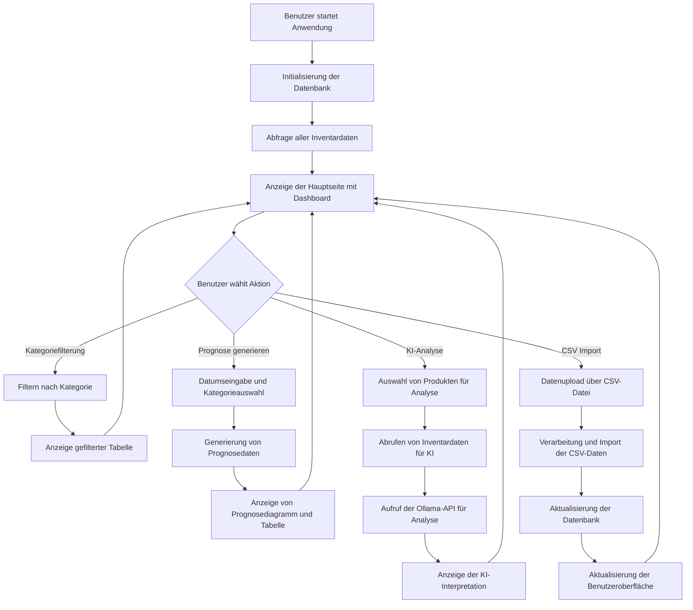

# Workflow Diagramm - SAP Lagerbestand Management System

## Hauptablauf des Systems



## Prognose-Workflow

```mermaid
flowchart TD
    A[Benutzer klickt "Prognosen generieren"] --> B{Kategorie ausgewählt}
    B -->|"Ja"| C[Filter nach ausgewählter Kategorie]
    B -->|"Nein"| D[Verwende alle Kategorien]
    C --> E[Bestimme Anfangs- und Enddatum]
    D --> E
    E --> F[Abrufen historischer Nachfragedaten]
    F --> G[Aufruf der SAP RPT-1 Simulation]
    G --> H[Generierung von Vorhersagedaten]
    H --> I[Einfügen der Prognosen in Datenbank]
    I --> J[Aktualisierung des Diagramms und der Tabelle]
    J --> K[Rückkehr zur Hauptansicht]
```

## KI-Analyse-Workflow

```mermaid
flowchart TD
    A[Benutzer klickt "Ergebnisse mit KI interpretieren"] --> B[Abrufen der ausgewählten Produkte]
    B --> C[Abrufen relevanter Inventar- und Prognosedaten]
    C --> D[Zusammenfassung der Daten für KI]
    D --> E{Verfügbarkeit des gpt-oss:20b-cloud Modells}
    E -->|"Ja"| F[Aufruf des gpt-oss:20b-cloud Modells]
    E -->|"Nein"| G[Abruf der verfügbaren Modelle]
    G --> H{Geeignetes lokales Modell gefunden}
    H -->|"Ja"| I[Aufruf des lokalen Modells]
    H -->|"Nein"| J[Fehler: Kein KI-Modell verfügbar]
    F --> K[Verarbeite KI-Antwort]
    I --> K
    J --> M[Anzeige des Fehlers]
    K --> L[Anzeige der KI-Interpretation]
```